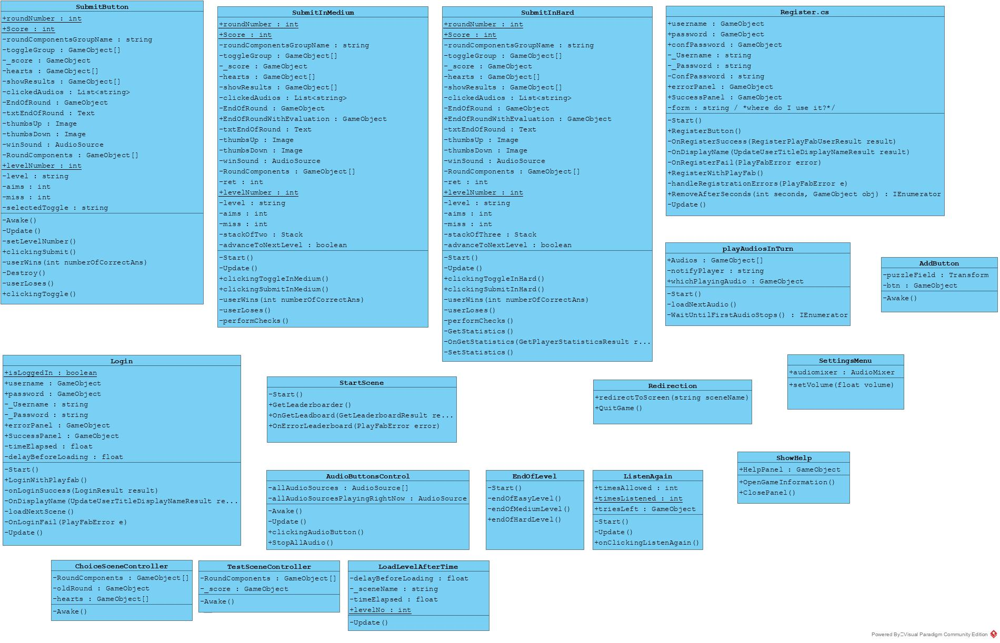

# SoundMemory

## Info
This game is part of a bigger on called MemoryGames, which I developed alongside my friends Sara Khalid and Layal Khantomani in May 2020, as our Software Engineering course project. The game consisted of multiple memory games. SoundMemory was the part of the game I worked on.

## Description
A game designed to train your ability to retain and recall sounds you heard after a short period of time.

| author | Sara |
|---|---|
| birth year | May, 2020 |
| tech & tools | Unity, C#, Playfab, MSSQL, Adobe XD |

## Screenshots

  
   
   
   
   
   

### Submit issues here
https://github.com/bowtiedalien/MemoryGames

### Some diagrams
**All classes, their attributes and operations:**

**How SubmitButton.cs works:**
